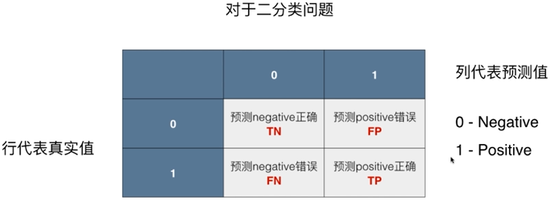
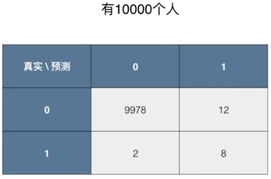
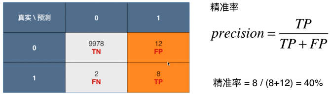
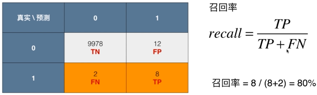
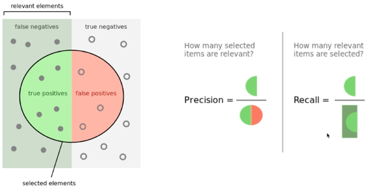
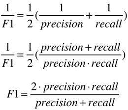
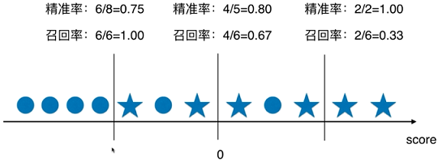
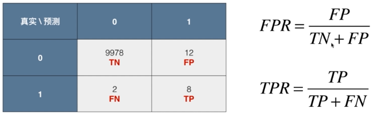
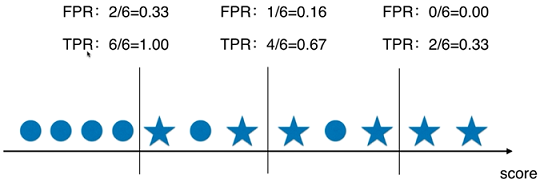

# 评价分类结果

例如：一个癌症预测系统，输入体检信息，可以判断是否有癌症，假设系统的预测准确度为99.9%，癌症产生的概率只有0.1%，我们的系统预测所有人搜是健康，即可达到99.9%的准确度

## 分类不准确的问题

对于极度偏斜（Skewed Data）的数据，只使用分类准确度时远远不够的，使用混淆做进一步的分析

## 混淆矩阵 Confusion Matrix

癌症系统案例

## 精准率和召回率

有时候我们注重精准率，如股票预测，漏掉某些股票上升周期可以容忍，错误的判断股票处于上升周期则无法容忍

有时候我们注重召回率，如病人诊断，如果病人生病了，却没有判断正确，可能会产生严重的后果，所以期望将所有有病的都能够召回。对于没有生病的的进行可进一步的诊断，最终发现没有病

### F1 Score

二者兼顾，F1 Score 是 precision 和 recall 的调和平均值，如果 precision 和 recall 极度不平衡，那么 F1 Score 也会比较小

### Precision-Recal 的平衡

### ROC 曲线

Receiver Operation Characteristic Curve

描述 TPR 和 FPR 之间的关系

TPR = Recal

TPR 和 FPR 之间的关系

