# 支撑向量机 SVM

Support Vector Machine

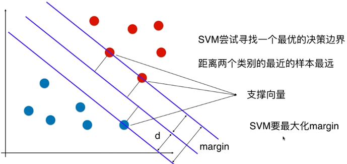

Hard Margin SVM 解决的是线性可分问题

Soft Margin SVM 解决的是线性不可分问题

## Hard Margin SVM

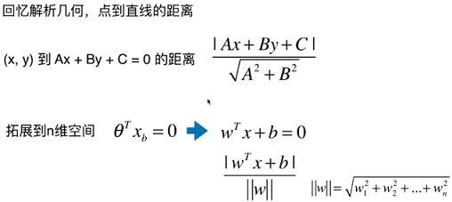

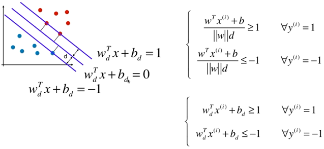

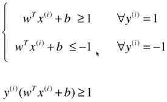

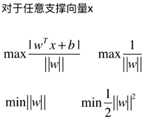

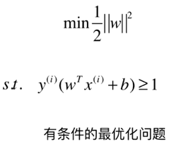

## Soft Margin SVM

对于每一个样本都允许有一个容错空间

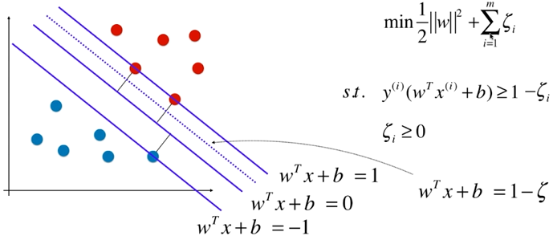

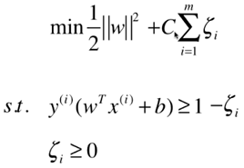

## 正则化

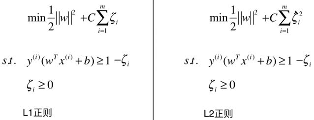

## 核函数

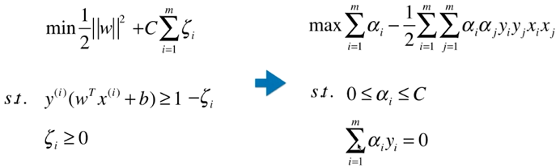

### 多项式核函数

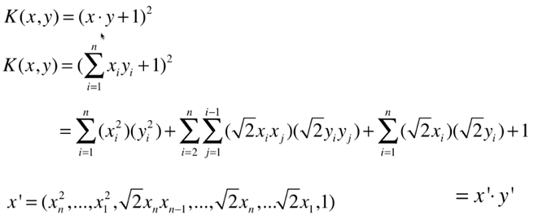

### 高斯核函数

