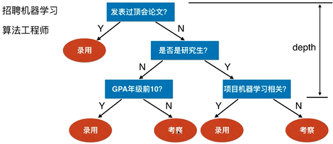
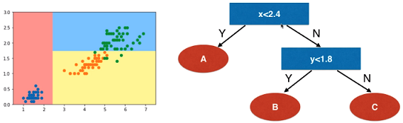
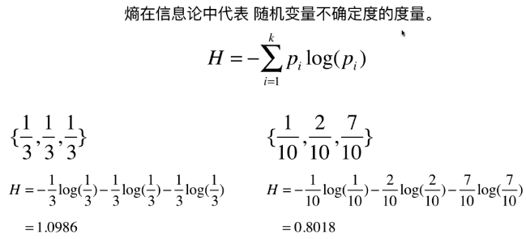
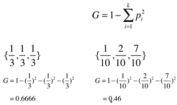

# 决策树

## 什么是决策树

特点：

- 非参数学习算法
- 可以解决分类问题
- 天然可以解决多分类问题
- 也可以解决回归问题
- 非常好的可解释性

问题：

- 每个节点在那个维度做划分？
- 某个维度在那个值上做划分？

## 信息熵

熵在信息论中代表随机变量不确定度的度量

熵越大，数据的不确定性越高；熵越小，数据的不确定性越低

右边的数据更加确定

决策树就是根据信息熵的原理来寻找一个最优的划分

## 基尼系数

和信息熵类似可以作为数据不确定性的度量

## 信息熵 vs 基尼系数

信息熵的计算比基尼系数慢

sklearn 中默认为基尼系数

大多数时候二者没有特别的效果优劣

## CART

Classification And Regression Tree

根据某一个维度d和某一个阈值v进行二分

### 复杂度

预测：O(logm)

训练：O(n*m*logm)

剪枝：降低复杂度，解决过拟合

## 解决回归问题

## 决策树的局限性

决策边界无法倾斜

对个别数据敏感