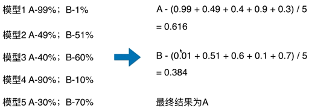
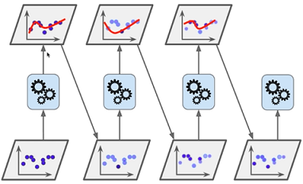
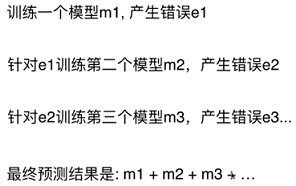
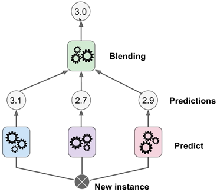
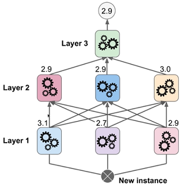

# 集成学习和随机森林

## 集成学习

生活中的集成学习：

- 买东西找别人推荐
- 病情确诊

## Soft Voting

要求集合的每一个模型都能估计概率

逻辑回归，kNN，决策树，SVC（probability）是基于概率的

## Bagging 和 Pasting

如何创建差异性？

每个子模型只看样本数据的一部分

取样：放回取样，不放回取样

放回取样：Bagging

不放回取样：Pasting

Bagging 更常用

## OOB Out-of-Bag

放回取样导致一部分样本很有可能没有取到

平均大约37%的样本没有取到

不适用测试数据集，而使用这部分没有取到的样本做测试/验证

## Bagging 的更多探讨

Bagging 的思路极易并行化处理

针对特征进行随机采样 Random Subspaces

既针对样本，又针对特征进行随机采样 Random Patches

## 随机森林

## Boosting

集成多个模型，每个模型都在尝试增强（Boosting）整体的效果

### Ada Boosting

### Gradient Boosting

### Stacking

