### 线性回归
- 解决回归问题
- 思想简单，实现容易
- 许多强大的非线性模型的基础
- 结果具有很好的可解释性
- 蕴含机器学习中的很多重要思想

#### 线性回归算法
寻找一条直线，最大程度的拟合样本特征和样本输出标记之间的关系

#### 简单线性回归
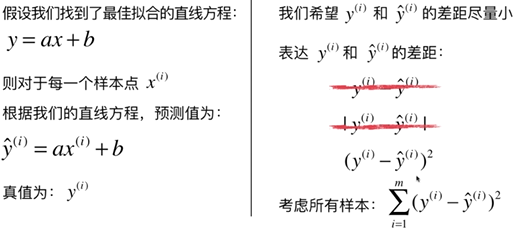

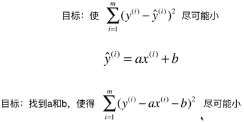

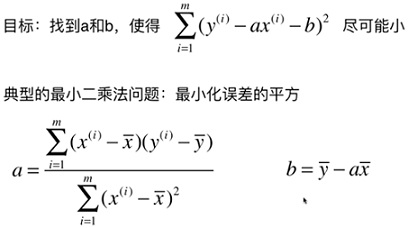

#### 一类机器学习算法的基本思路
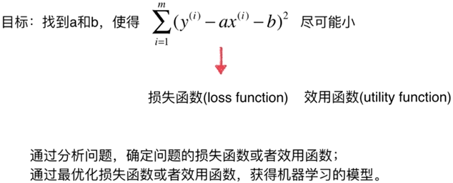

近乎所有参数学习算法都是这样的套路

线性回归，SVM，多项式回归，神经网络，逻辑回归......

最优化原理，如凸优化

#### 最小二乘法
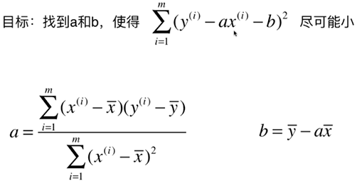

#### 回归算法的评价

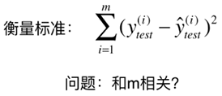

##### MSE
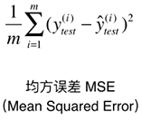

##### RMSE
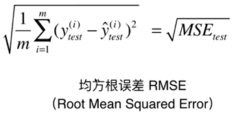

##### MAE
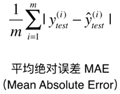

##### R Squared
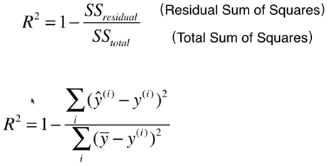

- 分子表示使用我们的模型预测产生的错误
- 分母表示使用 y 等于 y 的均值预测产生的错误，Baseline Model
- 上面式子中的分数部分就是数据拟合过程中错误的比重，用1吉安就相当于是得到数据拟合过程中正确的比重

R 方的结论：

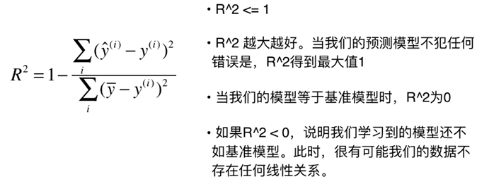

#### 多元线性回归
m 个样本， n 个向量

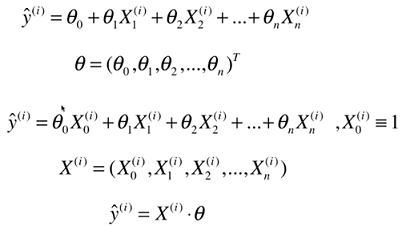

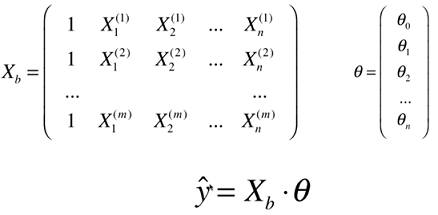

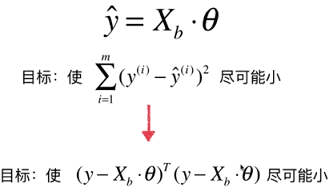

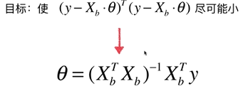

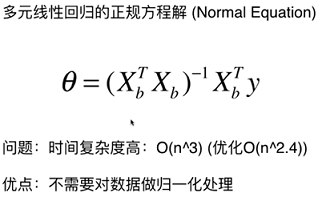

#### 线性回归算法总结
- 对数据有假设：线性，对比kNN对数据没有假设
- 有点：对数据具有强解释性