### PCA与梯度上升法

#### 主成分分析（Principal Component Analysis）

- 一个非监督的机器学习算法
- 主要用于数据的降维
- 通过降维，可以发现更便于人类理解的特征
- 其他应用：可视化；去噪

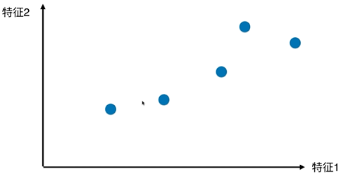

将点映射至一根直线

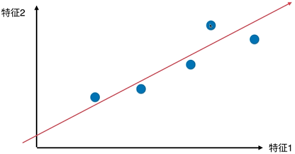

如何找到这个让样本间间距最大的轴？如何定义样本间间距？使用方差（Variance）

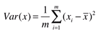

找到一个轴，使得样本空间的所有带你映射到这个轴后，方差最大

第一步：将样例的均值归为0（demean），即对所有变量减去样本平均值，分布没有变，实际上是移动了坐标轴

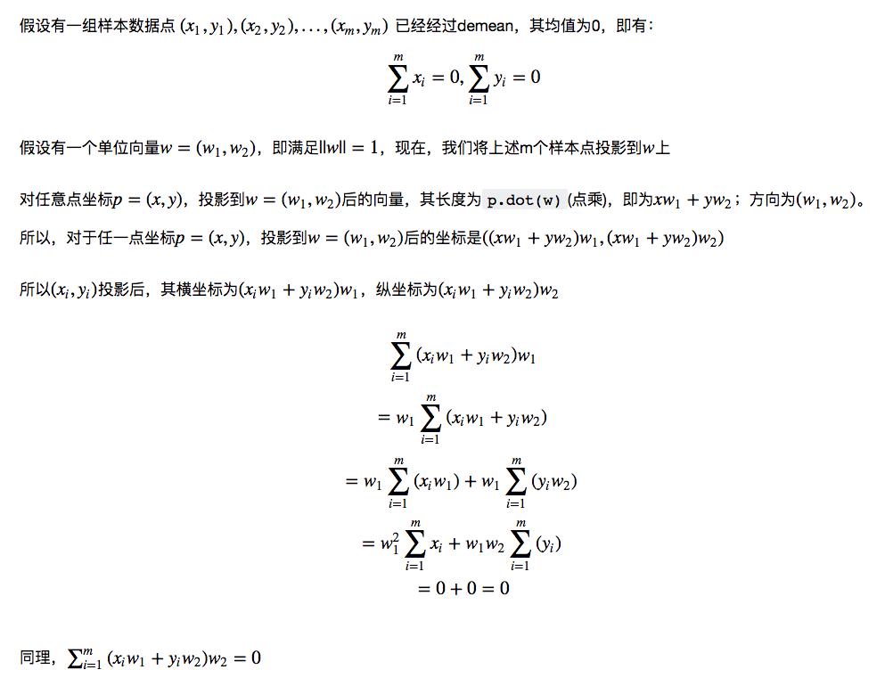

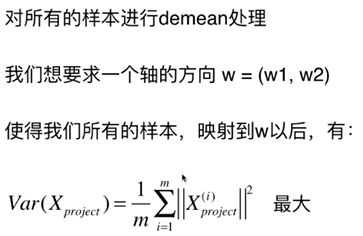

[投影](https://zh.wikipedia.org/wiki/%E6%8A%95%E5%BD%B1)

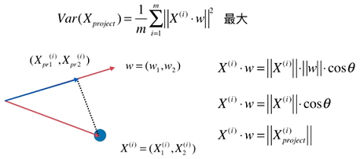

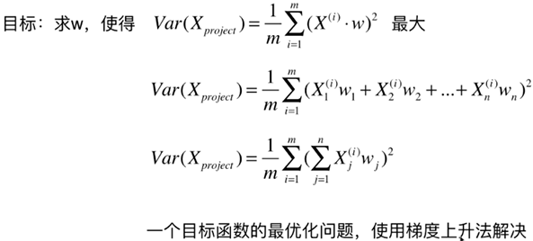

与线性回归的区别

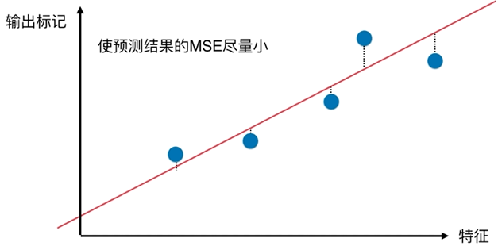

#### 梯度上升法解决主成分分析问题

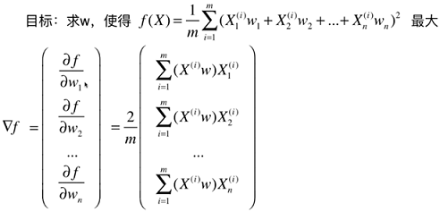

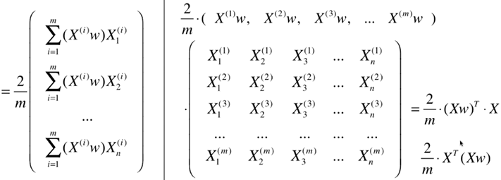

#### 求数据的前n个主成分

求出第一主成分以后，如何求出下一个主成分？

数据进行改变，将数据在第一个主成分上的分量去掉

在新的数据上求第一主成分

#### 高维数据向低维数据映射

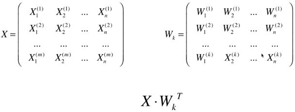

