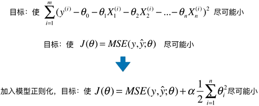
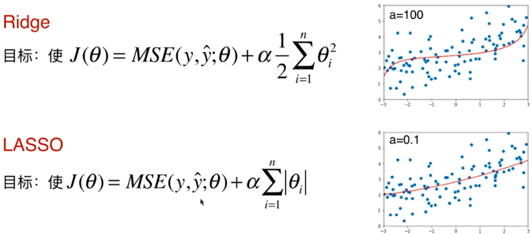
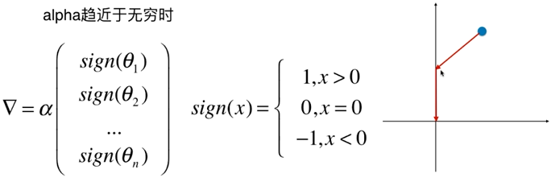
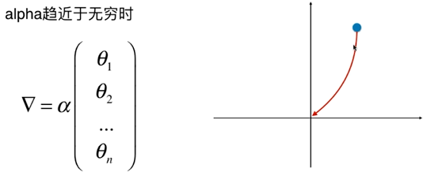
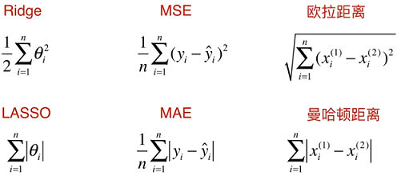
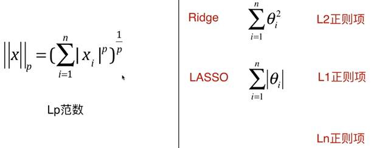
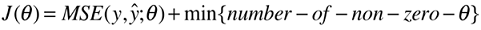
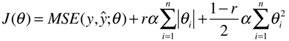

# 多项式回归与模型泛化

## 多项式回归

PolynomialFeatures(degree=3)

## 过拟合与欠拟合

过拟合与欠拟合的泛化能力都较差

过拟合（overfitting）：算法所训练的模型过多的表达了数据见的噪音关系

## 为什么要有训练数据集与测试数据集

## 学习曲线

随着训练样本的逐渐增都，算法训练出的模型的表现能力

欠拟合

过拟合

## 验证数据集与交叉验证

可能发生针对特定测试数据集过拟合了

### k-folds 交叉验证

把训练数据集分成k份，称为k-folds cross validation

缺点，每次训练k个模型，相当于整体性能慢了k倍

#### 留一法 LOO-CV

把训练数据集分成m份，称为留一法（Leave-One-Out Cross Validation），完全不受随机的影响，最接近模型真正的性能指标，缺点是计算量巨大

## 偏差和方差

有一些算法天生是高方差的算法，如 kNN。非参数学习通常都是高方差算法，因为不对数据进行任何假设。

有一些算法天生是高偏差算法，如线性回归。参数学习通常都是高偏差算法，因为对数据具有极强的假设

大多数算法具有相应的参数，可以调整偏差和方差，如kNN中的k，如线性回归中使用多项式回归

偏差和方差通常是矛盾的，降低偏差，会提高方差；降低方差，会提高偏差

机器学习的主要挑战，来自于方差（主要是算法领域）

解决高方差的通常手段：

- 降低模型复杂度
- 减少数据维度；降噪
- 增加样本数（比如深度学习，在数据量大的时候才能更充分的发挥它的效用）
- 使用验证集

### 模型误差

模型误差 = 偏差（Bias） + 方差（Variance） + 不可避免的误差

### 偏差（Bias）

导致偏差的主要原因：对问题本身的假设不正确，如非线性数据使用线性回归

欠拟合 underfitting

### 方差（Variance）

数据的一点点扰动都会较大的影响模型。通常原因，使用的模型太复杂，如高阶多项式回归

过拟合 overfitting

## 模型正则化 Regularization

### 岭回归

## LASSO Regression

Least Absolute Shrinkage and Selection Operator Regression

## 比较 Ridge 和 LASSO

LASSO 趋向于使得一部份 theta 值为 0，所以可作为特征选择用，挑选有用的特征

对于 Ridge

当特征特别多的时候 LASSO 可以帮助减少一部分特征，当特征不多的时候 LASSO 可能会减去一些有用的特征，这是更好的选择是 Ridge

## L1正则，L2正则

### L0正则

实际用L1正则取代L0正则，因为L0正则的优化是一个NP难的问题

## 弹性网 Elastic Net

同时结合了岭回归和LASSO的优势，