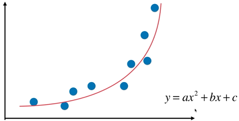
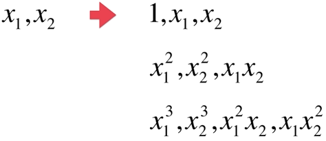
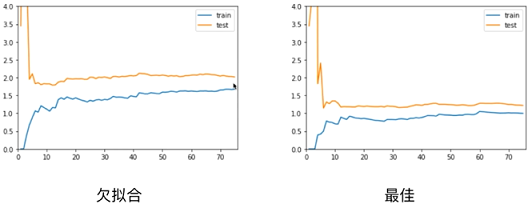
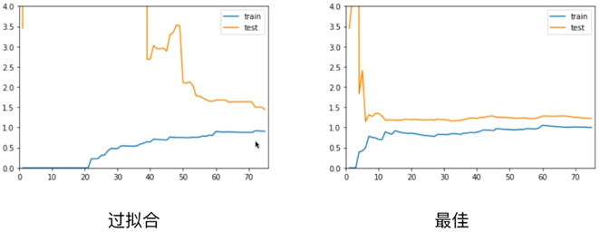
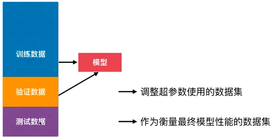
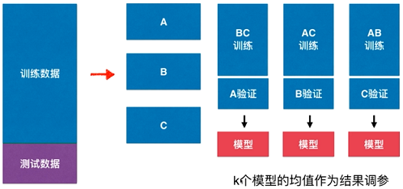
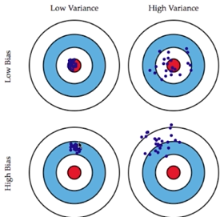

### 多项式回归与模型泛化

#### 多项式回归

PolynomialFeatures(degree=3)

#### 过拟合与欠拟合

过拟合与欠拟合的泛化能力都较差

过拟合（overfitting）：算法所训练的模型过多的表达了数据见的噪音关系

#### 为什么要有训练数据集与测试数据集

#### 学习曲线

随着训练样本的逐渐增都，算法训练出的模型的表现能力

欠拟合

过拟合

#### 验证数据集与交叉验证

可能发生针对特定测试数据集过拟合了

##### k-folds 交叉验证

把训练数据集分成k份，称为k-folds cross validation

缺点，每次训练k个模型，相当于整体性能慢了k倍

##### 留一法 LOO-CV

把训练数据集分成m份，称为留一法（Leave-One-Out Cross Validation），完全不受随机的影响，最接近模型真正的性能指标，缺点是计算量巨大

#### 偏差和方差

