# 逻辑回归 Logistic Regression

逻辑回归：解决分类问题

回归问题怎么解决分类问题：将样本的特征和样本发生的概率联系起来，概率是一个数

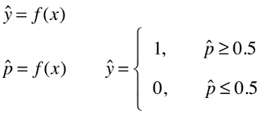

逻辑回归既可以看作是回归算法，也可以看作是分类算法，通常作为分类算法用，只可以解决二分类问题

## Sigmoid 函数

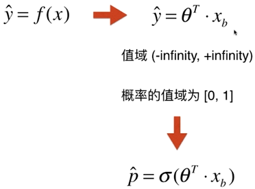

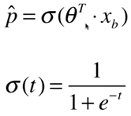

sigmoid 函数值域(0,1)，t > 0 时，p > 0.5，t < 0 时，p < 0.5

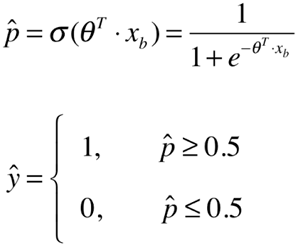

## 损失函数

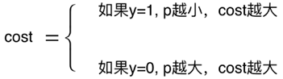

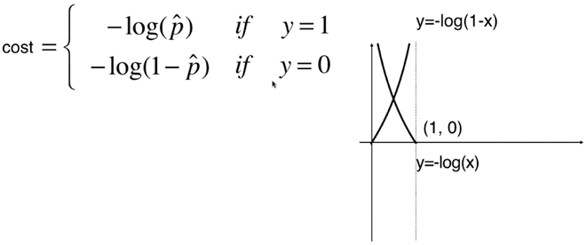

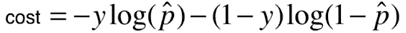

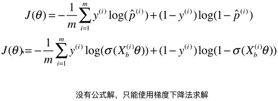

前一部分的求导过程

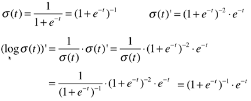

后一部分的求导过程

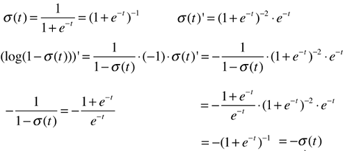

最终结果

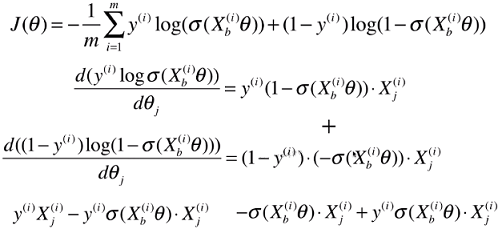

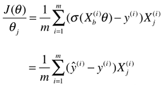

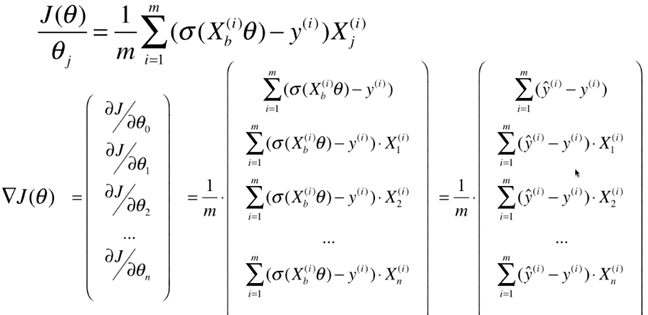

向量化

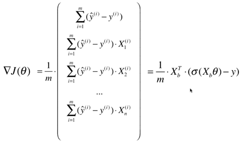

## 决策边界

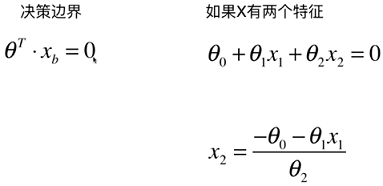

## 逻辑回归中使用正则化

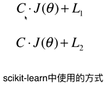

## 逻辑回归解决多分类

### OvR(One vs Rest)

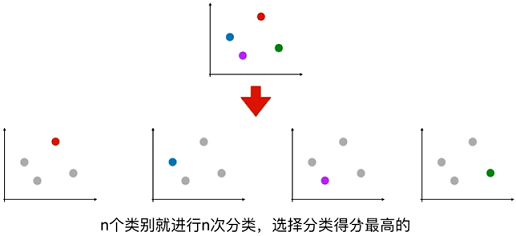

### OvO()

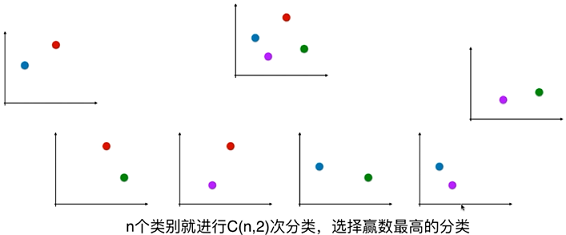