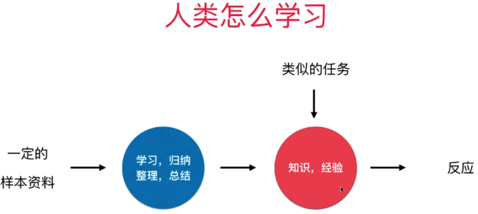

#### 什么是机器学习
最早的机器学习应用 - 垃圾邮件分辨

传统的计算机解决问题思路：
- 编写规则，定义“垃圾邮件”，让计算机执行
- 对于很多问题，规则很难定义
- 规则在不断变化

机器学习擅长的领域：图像识别 - 人脸识别，数字识别，邮局的邮编识别，车牌识别

##### 人类怎么学习

##### 机器怎么学习

##### 我们的生活中已经大量运用了机器学习
- 判断信用卡发放是否有风险
- 在使用 Google 搜索时根据你输入的部分关键字，判断你真正想搜索的内容
- 浏览商品是，你最有可能购买的商品？
- 你有可能喜欢的音乐，图书，文章？
- 语言识别；人脸识别
- 金融领域；医疗诊断；市场分析

##### 未来将有更多的领域需要运用机器学习
- 无人驾驶
- 安全领域
- 医疗领域
- 金融领域；市场领域
- 自然语言处理 - 智能翻译
- 各种专有领域：矿产勘查，宇宙探索，药物研发，...
