#### kNN - k近邻算法（k-Nearest Neighbors）
- 思想简单
- 应用数学知识少（近乎为零）
- 效果好
- 可以解释机器学习算法使用过程中的很多细节问题
- 更完整的刻画机器学习应用的流程

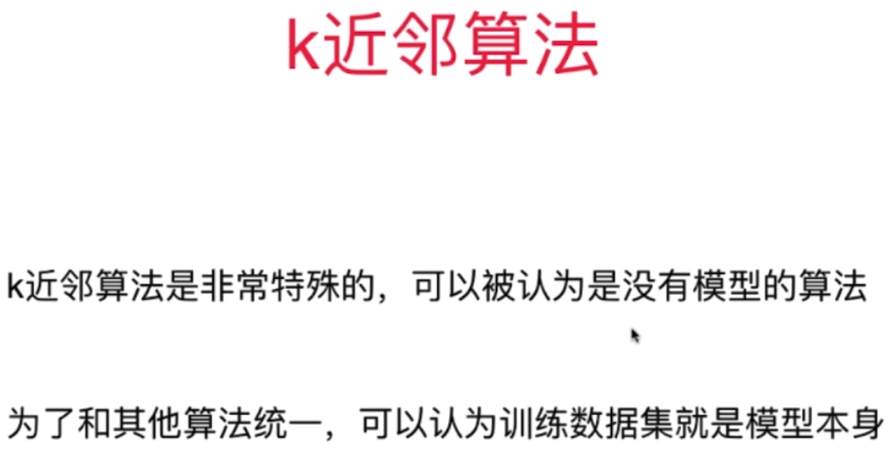

#### 欧拉距离
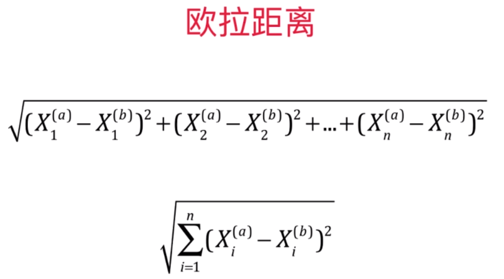

#### 超参数和模型参数
- 超参数：在算法运行前需要决定的参数
- 模型算法：算法过程中学习的参数

kNN 算法没有模型参数

kNN 算法中的 k 是典型的超参数

#### 寻找好的超参数
- 领域知识
- 经验数值
- 实验搜索

#### 考虑权重的 kNN

#### 曼哈顿距离
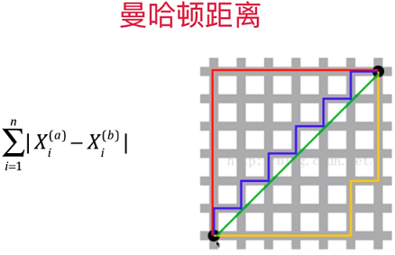

#### 明可夫斯基距离

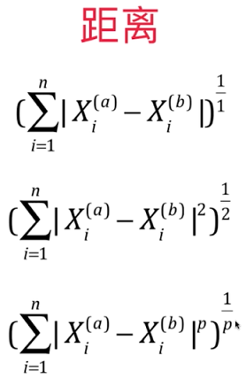

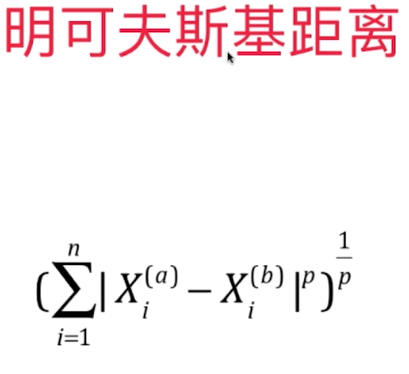

由此可获知有一个超参数 p

#### 更多的距离
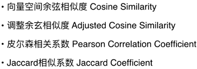

#### 数据归一化
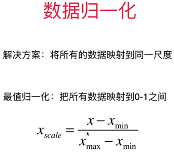

##### 最值归一化 normalization
适用于分布有明显边界的情况；守 outlier 影响较大

##### 均值方差归一化 standardization
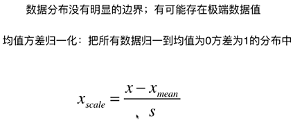

##### 对测试数据集的归一化
不正确的做法：

正确做法：

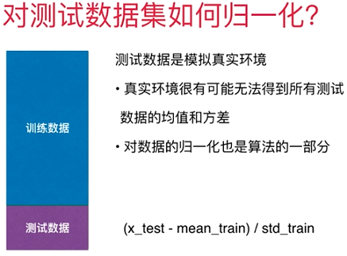

要保存训练数据集得到的均值和方差

##### scikit-learn 中的 Scaler
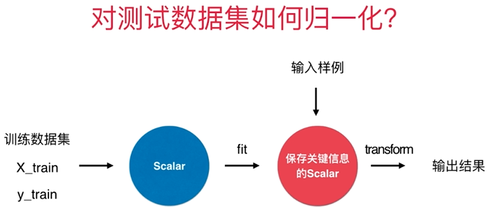

#### 更多有关k近邻算法
解决分类问题

天然可以解决多分类问题

缺点一：效率低下，如果训练集有 m 个样本，n 个特征，则预测每一个新的数据，需要 O(m*n)。可进行相应的优化，使用树结构：KD-Tree，Ball-Tree，不过任然低效

缺点二：高度数据相关

缺点三：预测结果不具有可解释性

缺点四：维数灾难，随着维度的增加，“看似相近”的两个点之间的距离越来越大。解决方法：降低维度

##### 使用 k 近邻算法解决回归问题
KNeighborsRegressor

#### 机器学习流程回顾
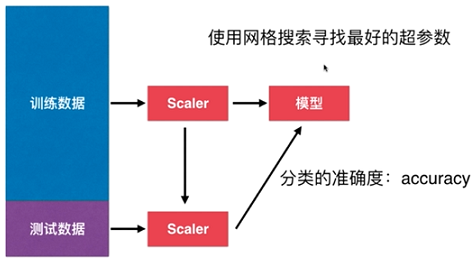