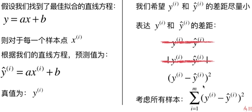
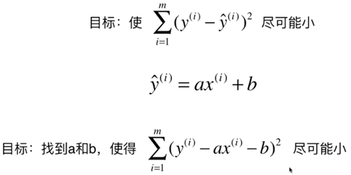
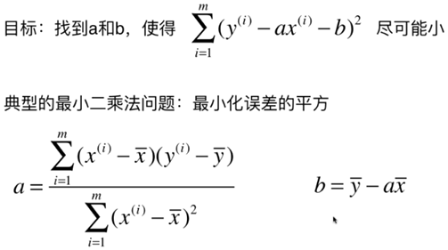

#### 线性回归
- 解决回归问题
- 思想简单，实现容易
- 许多强大的非线性模型的基础
- 结果具有很好的可解释性
- 蕴含机器学习中的很多重要思想

##### 线性回归算法
寻找一条直线，最大程度的拟合样本特征和样本输出标记之间的关系

##### 简单线性回归

##### 一类机器学习算法的基本思路

近乎所有参数学习算法都是这样的套路

线性回归，SVM，多项式回归，神经网络，逻辑回归......

最优化原理，如凸优化